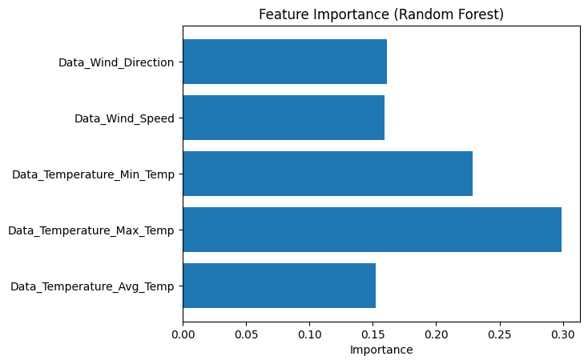

#  Rainfall Prediction using Ensemble Machine Learning

🔗 **Live App:**  
https://rain-fall-prediction-ensemble-ml-cw4afpxjcsrlv7mnmkjhai.streamlit.app/

---

##  Overview

This project builds and deploys a **rainfall prediction model** using ensemble machine learning techniques. The model predicts whether it will rain based on meteorological inputs such as temperature and wind conditions.

The final model is deployed as an interactive web application using **Streamlit**.

---

##  Features

- Ensemble learning using:
  - Random Forest (Bagging)
  - Gradient Boosting
  - XGBoost (Boosting)
  - Stacking Classifier (Meta-learning)
- Threshold tuning for improved F1-score
- Interactive web app for real-time prediction
- Model interpretability using SHAP (in notebook)

---

##  Model Details

- Problem Type: Binary Classification (Rain / No Rain)
- Evaluation Metric: F1 Score (due to class imbalance)
- Best Performance:
  - F1 Score ≈ **0.87**

---

##  Input Features

- Average Temperature  
- Maximum Temperature  
- Minimum Temperature  
- Wind Speed  
- Wind Direction  

---

##  How It Works

1. User inputs weather conditions  
2. Stacked ensemble model processes input  
3. Model outputs:
   - Rain / No Rain prediction  
   - Probability score  

---

## 📊 Model Interpretation

### 🔍 SHAP Summary Plot


This plot shows how each feature contributes to rainfall prediction.

---

### 📈 Feature Importance


Maximum and minimum temperatures are the most influential features.

##  Run Locally

```bash
git clone https://github.com/your-username/rainfall-ensemble-app.git
cd rainfall-ensemble-app
pip install -r requirements.txt
streamlit run app.py
